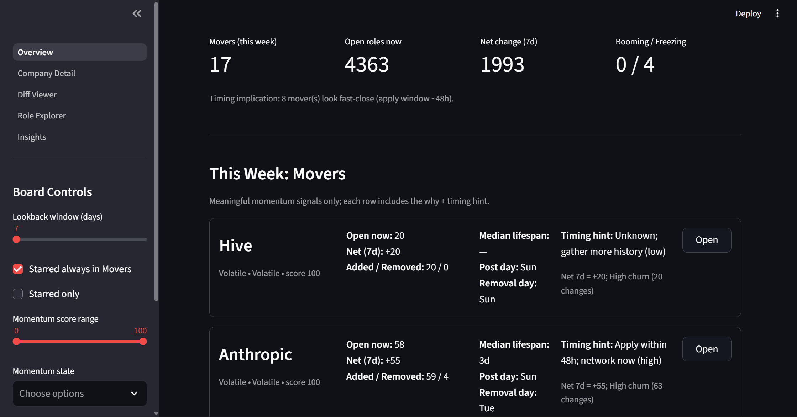
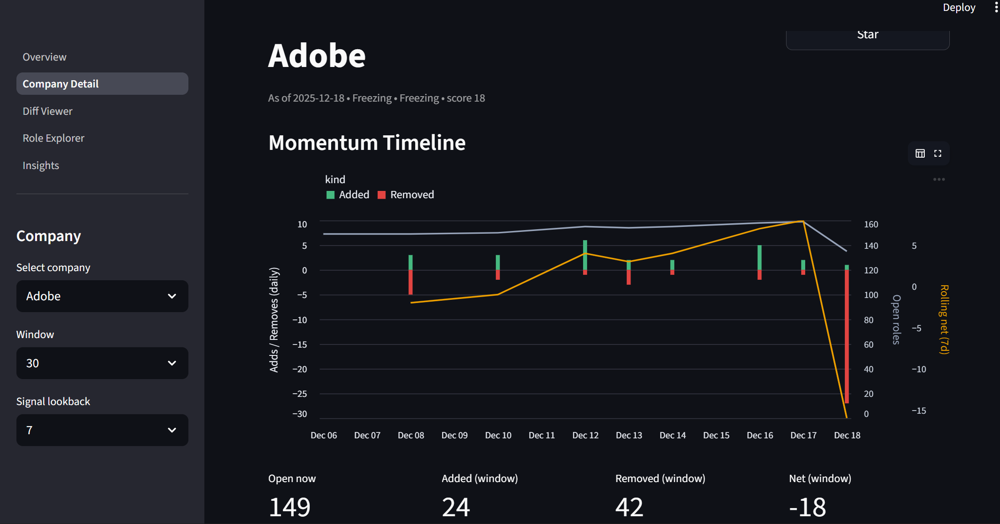
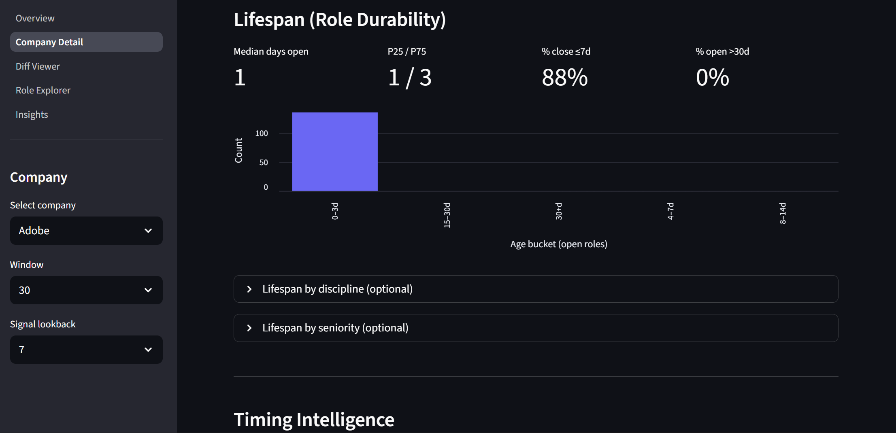

# Hiring Trend Tracker (Momentum Board)

This project is designed for **my personal job-search workflow**, but it’s usable by any job seeker who wants a **weekly signal dashboard** instead of another job board.

It scrapes jobs across many companies, keeps daily history (snapshots + diffs), computes **momentum + timing signals**, and presents everything in a **Streamlit dashboard**.

## Screenshots

**Momentum Board**



**Company Intelligence**





## What It Answers (Immediately)

- **Which companies have meaningful momentum this week?** (Booming / Freezing / Volatile / Stable + why)
- **What does that imply for timing?** (apply-window vs networking trigger)
- **How long do roles last at this company?** (median lifespan + fast-close % + age buckets)
- **What’s the global market pulse in my domain?** (open roles trend, net change, weekday effects, mix shift, concentration)

## Key Features

- **Momentum Board (dashboard home)**: Movers expanded by default; everyone else stays available but collapsed.
- **Signal engine**: gates “Movers” to avoid noise and emits a “why it triggered” string.
- **Timing intelligence**: best posting/removal weekday + apply window hint (fast-close vs evergreen).
- **Role durability analytics**: role lifespan inferred from daily snapshots (no extra UX for role tracking).
- **News reframed as signals**: headlines appear only when they explain a hiring change (spike/freeze/mix shift).

## Data Model (Simple)

- `data/raw/…` / `data/filtered/…`: daily snapshots per company
- `data/diffs/…`: Added / Removed / Changed compared to prior snapshot
- `news.db`: SQLite database for analytics tables (signals, lifespan summaries, news aggregates)

## Quick Start (Windows)

### 1) Install

```powershell
python -m venv .venv
.\.venv\Scripts\python -m pip install -r requirements.txt
```

### 2) Configure (optional but recommended)

Create a `.env` in repo root:

```text
GNEWS_API_KEY=...
FINNHUB_API_KEY=...
```

If you don’t set keys, the dashboard still works from job data; news features will be limited.

### 3) Run a scrape (jobs + news)

```powershell
.\.venv\Scripts\python -m src.main --all --days 7
```

### 4) Start the dashboard

```powershell
.\.venv\Scripts\python -m streamlit run dashboard\Overview.py
```

## Daily Automation (Task Scheduler)

- Daily scrape + logs: `scripts/run_daily_scrape.bat`
  - Logs: `logs/scheduler/scrape_<timestamp>.log`
- Start dashboard on login: `scripts/start_dashboard.bat`
  - Relaunches hidden so it doesn’t leave a visible console window.

Suggested schedules:
- **Scrape**: daily at a consistent time (e.g., 6:30 AM local)
- **Dashboard**: at logon (so it’s always available on `http://localhost:8501`)

## Using This for Your Personal Use Case

1) **Pick your company list**
- Edit `src/config/companies.json` (add/remove companies, set `ats`, optional `ticker`).

2) **Customize your role preferences**
- Edit `dashboard/scoring.py`:
  - `USER_PROFILE["target_keywords"]`
  - `USER_PROFILE["avoid_keywords"]`
  - seniority/location preferences

3) **Customize filtering rules (role families / geo)**
- Edit `src/config.py` and/or `src/utils.py` (US eligibility + title filtering logic).

4) **Scrape + view**
- Run: `.\.venv\Scripts\python -m src.main --all`
- Start dashboard: `.\.venv\Scripts\python -m streamlit run dashboard\Overview.py`

## Backfilling (If You Already Have Snapshot History)

If you already have `data/filtered/...` history and want lifespan + open-now history computed immediately:

```powershell
.\.venv\Scripts\python scripts\backfill_analytics.py
```

## Notes

- This is intentionally optimized for **trend + timing** (not a traditional job board UX).
- External APIs have quotas (especially news). If you see `429` errors, reduce request rates or rotate keys.

